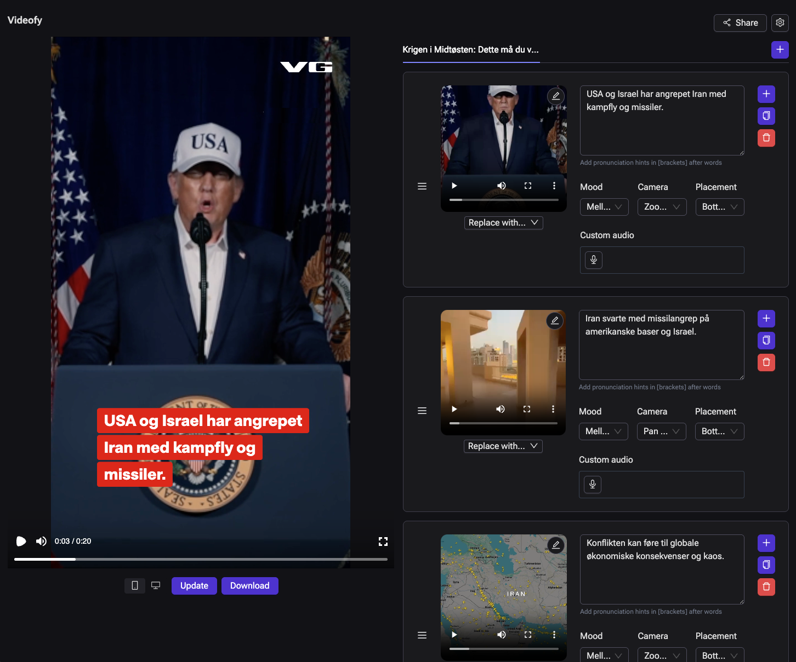
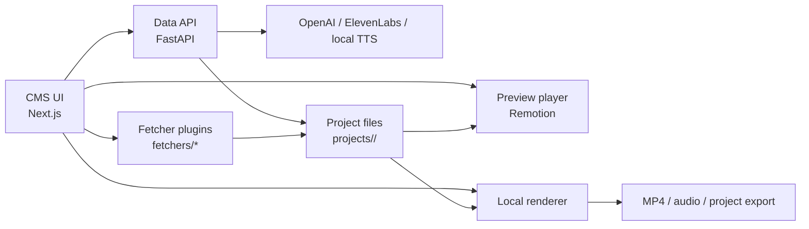

# Videofy Minimal



Videofy Minimal is a local tool for turning news articles into short videos for digital signage screens.

It fetches article content, generates a short manuscript, matches visuals, produces narration, and renders a final video through a review flow in the CMS UI.

Here is an example video from one of our brands: [example_video_e24.mp4](./example_video_e24.mp4)

This repository is designed to run on a laptop with OpenAI credentials, and supports either ElevenLabs or a free local macOS narration fallback. It keeps the core workflow, but leaves out most of the internal integrations and infrastructure used in Schibsted's full Videofy setup.

Found a problem or want to chat about the project? Open an issue or join our [Discord server](https://discord.gg/vFvvdC3B)

## Polaris Media Extensions

This repository now also includes Polaris Media-specific extensions on top of the open source Schibsted base:

- Polaris article import through CAPI
- support for all Polaris newsrooms discovered from Polaris newsroom metadata
- article lookup from `collections/v1/{newsroom}/articles`
- automatic newsroom detection from Polaris article URLs
- newsroom-specific branding through `newsroom-branding.json` and the CMS theme editor
- Stream/SVP video browsing and import inside the editor
- local Norwegian narration fallback on macOS when ElevenLabs is not configured

These additions make the Polaris fetcher and Polaris newsroom branding the primary workflow for Polaris environments.

## What It Does

Videofy Minimal takes content from a source such as Reuters, AP, or a test web URL, builds a manuscript, matches media, generates voiceover, and renders a video.

The result is a local MP4 with a human-in-the-loop workflow in the CMS UI, so editors can review, tweak, and rerun before rendering.

## Architecture

At a high level, the CMS orchestrates fetching, generation, preview, and rendering, while project state is stored locally under `projects/<projectId>/`.



The CMS is the operator surface, the FastAPI service handles generation and processing, and each project is persisted under `projects/<projectId>/`.

## Quickstart

### 1. Install Dependencies (macOS with Homebrew)

```bash
brew install uv node ffmpeg
```

You also need:
- Python 3.12
- npm (comes with Node)

### 2. Configure Environment

```bash
cp .env.example .env
```

Add your API credentials in `.env`:
- `OPENAI_API_KEY`
- `ELEVENLABS_API_KEY` or local TTS settings below

Optional local narration fallback on macOS:
- `LOCAL_TTS_ENABLED=true`
- `LOCAL_TTS_VOICE=Nora`
- `LOCAL_TTS_RATE=145`

TTS behavior:
- if `ELEVENLABS_API_KEY` is set, ElevenLabs is used
- if ElevenLabs is not configured and `LOCAL_TTS_ENABLED=true`, local macOS `say` is used
- if neither is available, `process` still works, but narration/voiceover is skipped
- `LOCAL_TTS_RATE` controls the local speech speed in words per minute

Optional fetcher credentials:
- `CAPI_USERNAME`
- `CAPI_PASSWORD`
- `REUTERS_CLIENT_ID`
- `REUTERS_CLIENT_SECRET`
- `REUTERS_AUDIENCE`
- `REUTERS_GRANT_TYPE`
- `REUTERS_SCOPE`
- `AP_API_KEY`

Fetcher visibility in CMS depends on these values:
- `web` is always available
- `polaris-capi` is shown only when `CAPI_USERNAME` and `CAPI_PASSWORD` are set
- `reuters` is shown only when all Reuters values are set
- `ap` is shown only when `AP_API_KEY` is set

### 3. Install Project Dependencies

```bash
uv sync
npm install
```

### 4. Start Everything

```bash
make dev
```

If you want hotspot model support while using `make dev`, run:

```bash
make dev HOTSPOT=1
```

Open:
- CMS: `http://127.0.0.1:3000`
- API: `http://127.0.0.1:8001`

## Docker Compose

To run the CMS and API in containers instead:

```bash
docker compose up --build
```

Docker Compose reads the same local `.env` file for values such as `OPENAI_API_KEY` and `ELEVENLABS_API_KEY`.

Open:
- CMS: `http://127.0.0.1:3000`
- API: `http://127.0.0.1:8001`

## Projects and Folder Structure

Every run is stored as a project in `projects/<projectId>/`.

Projects are split into:
- `input`: imported source files and article data
- `working`: intermediate and editable generation state
- `output`: final processed files and rendered videos

Example layout:

```text
projects/
  <projectId>/
    generation.json
    input/
      article.json
      images/
      videos/
    working/
      manuscript.json
      cms-generation.json
      config.override.json
      analysis/
      audio/
      uploads/
    output/
      processed_manuscript.json
      render-vertical.mp4
      render-horizontal.mp4
```

Key files:
- `generation.json`: project-level settings (brand, options, timestamps)
- `input/article.json`: fetched article text and media references
- `working/*`: data generated during `generate` and `process`, plus UI edits
- `output/*`: final render-ready artifacts

## Fetchers

Fetchers are a drop-in plugin architecture to add your own ways to get content into the system.

Each fetcher lives under `fetchers/<id>/` and defines:
- input fields (`fetcher.json`)
- implementation (`fetcher.py`)

In production, each brand/newsroom should build a proper fetcher integration against its own content APIs to get the highest quality data. 

Included fetchers:
- `polaris-capi`: shown when `CAPI_USERNAME` + `CAPI_PASSWORD` are set. Supports Polaris article URL/ID import, newsroom dropdown, and latest-article lookup from Polaris CAPI collections. Newsrooms are resolved dynamically from Polaris newsroom metadata, so all supported Polaris newsrooms are available without hardcoding a short allowlist.
- `web`: generic HTML fetcher for local testing and demos
- `reuters`: shown only when Reuters API credentials are set
- `ap`: shown only when AP credentials are set

The Polaris fetcher is the default workflow in CMS when CAPI credentials are available.
The web fetcher is useful for quick testing, but should not be treated as a production-grade ingestion path.

### Polaris Workflow

The Polaris fetcher accepts either:
- a full article URL
- a raw article ID

If you paste a Polaris URL, the newsroom is resolved automatically from the domain.
If you only have a raw article ID, you can select the newsroom from the dropdown.

The CMS also includes:
- a newsroom dropdown populated from Polaris newsroom metadata
- a `Hent siste artikler` helper that loads recent article IDs from `collections/v1/{newsroom}/articles`
- article media import from CAPI plus Polaris image URLs from `vcdn.polarismedia.no`
- Stream/SVP video browsing and selection in `Replace -> Add media -> Video`
- automatic project defaults for Polaris article workflows when CAPI credentials are present

## OpenAI Models

CMS lets you choose the generation model when you import an article or add another article to an existing generation.

Available models:
- `gpt-4o` (default)
- `gpt-5.1`
- `gpt-5.4`

The selected model is used for both:
- script generation
- media analysis / placement

The backend uses the OpenAI Responses API and applies GPT-5-specific request options automatically. No `temperature` parameter is used for GPT-5 requests.

## Brands

Brands are configured in `brands/*.json`.

A brand controls the look, voice, and generation behavior, including:
- prompts
- OpenAI models (`manuscriptModel`, `mediaModel`)
- voice + TTS defaults
- logo
- intro/wipe/outro assets
- colors and visual theme
- export defaults

To add a new brand:
1. Copy `brands/default.json`
2. Rename to your brand id (for example `brands/mybrand.json`)
3. Update logo, wipes, colors, prompts, and voice settings
4. Restart app (or refresh) and select the new brand in CMS

## Publications And Newsrooms

There are two configuration layers for different publications:

### 1. Brand Defaults

Use `brands/*.json` for defaults shared across a whole setup:
- prompts
- OpenAI models
- voice defaults
- intro / wipe / outro assets
- export defaults
- player-level defaults such as logo, colors, music and cuts

### 2. Per-Newsroom Overrides

Use `newsroom-branding.json` for publication/newsroom-specific overrides, especially for Polaris titles.

Typical newsroom overrides:
- domain
- logo image or logo text
- logo placement
- disable intro / wipe / outro
- player color overrides
- story progress layout and shape
- outro card
- advanced `player` overrides such as fonts, styles and background music

For Polaris this means each newsroom can have its own:
- logo and logo mode
- progress indicator layout
- colors and map marker color
- intro/wipe/outro visibility
- outro card content
- advanced player JSON overrides

Example:

```json
{
  "default": {
    "disableIntro": true,
    "disableWipe": true,
    "disableOutro": true
  },
  "newsrooms": {
    "fvn": {
      "domain": "www.fvn.no",
      "text": "FVN",
      "player": {
        "colors": {
          "text": {
            "background": "#0051a8",
            "text": "#ffffff"
          }
        },
        "outroCard": {
          "duration": 3,
          "title": "Les mer på fvn.no",
          "body": "Finn hele saken og mer journalistikk på fvn.no"
        }
      }
    }
  }
}
```

### GUI Editing

You can edit newsroom-specific presentation in CMS:
1. Open a project
2. Click `Edit theme`
3. Open `Newsroom Theme`

The GUI supports:
- logo / text overrides
- intro, wipe and outro visibility
- color overrides
- outro card content
- advanced player JSON for fonts, styles and other player-level overrides

If no logo override is set, Polaris projects use the newsroom/domain favicon by default.

## Maps

The editor supports interactive OpenStreetMap-based map assets.

For each map asset you can:
- search for a place
- click or drag to place the marker
- choose whether a place label should be shown in the video
- choose detail level: `Oversikt`, `Standard`, `Nært`

## Player

Rendering is built with [Remotion](https://www.remotion.dev/).

This project uses Remotion for composition and local rendering. For commercial use, verify that your usage complies with Remotion license terms. You might need a license. 

## Hotspot Model

We have trained our own hotspot model to pick good focus areas on press images (where motion/crops should center). Videofy Minimal can use this model by running the commands below.

The model is fetched from Hugging Face and runs locally in a worker process. If unavailable, the pipeline still runs with a fallback hotspot strategy.

To enable hotspot dependencies:

```bash
uv sync --group hotspot
```

If you start with `make dev`, include the hotspot group there too:

```bash
make dev HOTSPOT=1
```

## Credits

Videofy Minimal was built with contributions from the following people:
- Johanna Johansson
- Johannes Andersen
- Edvard Høiby
- Njål Borch
- Anders Haarr
- Magnus Jensen
